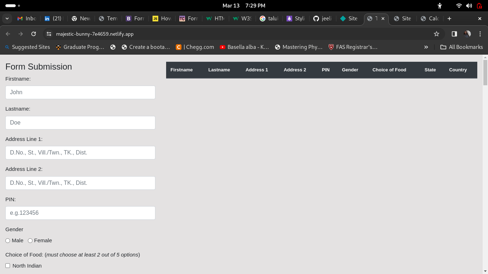
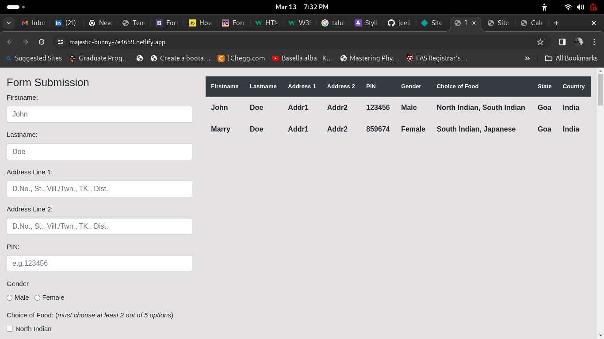

# Temporary Database

The entered form data in this web application, will be stored in a table in the same page.

## Table of Contents

- [Introduction](#introduction)
- [Project Images](#Images)
- [Installation](#installation)
- [Usage](#usage)
- [License](#license)

## Introduction

Users can enter their information as a form data and after submitting those data will be stored in a table that available in the same webpage. This form contain some required information that users want to enter. Users are advised not to enter sensitive information.

[Netlify link](https://majestic-bunny-7e4659.netlify.app/)

## Images

The below image tell about how the homepage looks like.

## Installation

No installation is required except a latest web browser.

## Usage

It is purposed only(visualization perspective) for how the data can be stored in database such as SQL databases such as MySQL or Postgresql but not as NoSQL.

## License

MIT License

---
